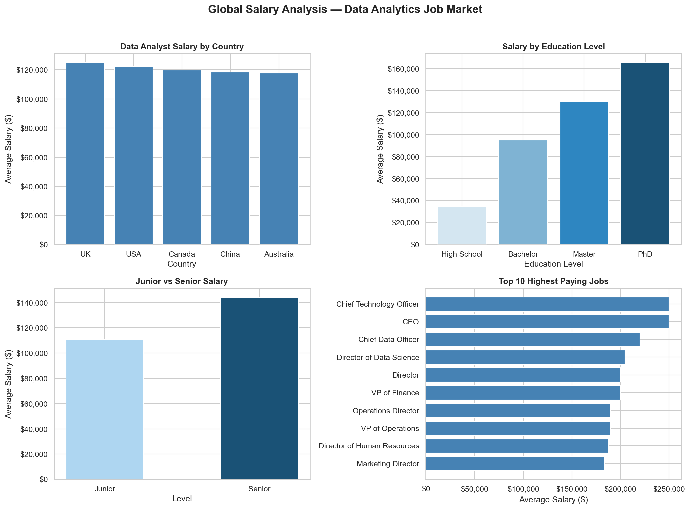

# salary-analysis
Analysis of global salary trends across 5 countries using Python, pandas, and Seaborn
# Global Salary Analysis — Data Analytics Job Market

## Overview
Analysis of 6,680 salary records across 5 countries to understand
compensation trends in the data analytics job market.

## Dataset
- Source: Kaggle — Salary by Job Title and Country
- Size: 6,680 records
- Countries: USA, UK, Canada, China, Australia
- Currency: USD

## Key Findings
1. **Data Analysts earn $120,606 on average globally**
   - UK pays the most ($125,097)
   - Australia pays the least ($117,807)

2. **Education has the biggest salary impact**
   - High School: $34,416
   - Bachelor: $95,177
   - Master: $130,078
   - PhD: $165,772

3. **Seniority adds 30.4% to salary**
   - Junior: $110,551
   - Senior: $144,159

4. **Career ceiling for data professionals**
   - Data Analyst: ~$120,000
   - Director of Data Science: ~$204,000
   - CTO/CEO: $250,000

## Dashboard

## Tools Used
- Python
- pandas
- Matplotlib
- Seaborn

## How to Run
1. Download the dataset from Kaggle
2. Run `salary_project.py`
